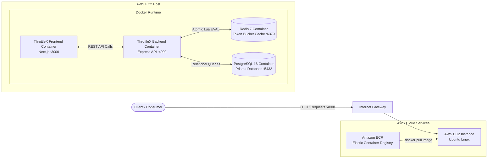

# ⚡ ThrottleX — Full-Stack API Protection Platform

ThrottleX is a full-stack platform that protects APIs from abuse, scraping, bots, and accidental traffic spikes. Admins create API keys, configure route-level rate limits, protect demo APIs, and monitor allowed/blocked traffic — all from a dashboard.

The rate-limiting engine is **Redis-backed** and uses **Lua scripts** for atomic, concurrency-safe **Token Bucket** rate limiting.

---

## Why this project matters

Most backend apps ship without real API protection. ThrottleX demonstrates the full stack of concerns a production rate limiter must solve:

- **Concurrency safety** — a naive `GET → check → INCR` limiter oversells capacity under load. ThrottleX uses a single atomic Lua script so accounting is exact even under thousands of parallel requests.
- **Distributed state** — limits live in Redis, not process memory, so they hold across many backend instances.
- **Hot-key awareness** — Redis keys are namespaced per API key so no single key becomes a fleet-wide bottleneck.
- **Security** — raw API keys are never stored; only SHA-256 hashes reach the database, logs, or Redis keys.
- **Operability** — standard `X-RateLimit-*` headers, request logs, analytics, and a fail-open strategy when Redis is down.

---

## Architecture

```
        Browser Dashboard
               │
               ▼
      Next.js Frontend (React, Tailwind, Recharts)
               │  REST + JWT
               ▼
      Express Backend API (TypeScript)
        │                 │
        │                 └────────────► Redis  (token-bucket state, Lua scripts)
        │
        └────────────► PostgreSQL (users, API keys, rules, request logs)  via Prisma
               │
               ▼
      Protected Demo APIs (/api/*)  ── guarded by x-api-key + rate limiter
```

- **Frontend**: Next.js (App Router) + TypeScript + Tailwind CSS + Recharts
- **Backend**: Express.js + TypeScript
- **Database**: PostgreSQL + Prisma
- **Rate-limit state**: Redis via ioredis + Lua
- **Auth**: JWT admin auth
- **Infra**: Docker Compose (Postgres + Redis)
- **Tests**: Jest + Supertest

---

## How rate limiting works

Each protected request flows through the `rateLimit` middleware:

1. Read the `x-api-key` header.
2. SHA-256 hash it and look up the `ApiKey` row (raw key never used for lookup/storage).
3. Reject if the key is missing, invalid, or `DISABLED`.
4. Resolve the effective rule: an explicit `RateLimitRule` for `(plan, method, route)`, else the plan's default limits.
5. Run the atomic Redis/Lua **token bucket**.
6. Attach `X-RateLimit-*` headers.
7. Write a `RequestLog` row (allowed/blocked) and bump `lastUsedAt`.
8. Continue to the handler, or return `429`.

### Token Bucket

- A bucket holds up to `capacity` tokens and refills continuously at `refillRatePerSecond`.
- Each request consumes 1 token; it's allowed only if ≥1 token remains after refilling.
- Bursts up to `capacity` are allowed; the sustained rate equals the refill rate.

### Redis Lua explanation

The whole **read → refill → check → consume → write → set TTL** sequence runs inside one Lua script. Redis executes scripts atomically, so no other client can interleave between the read and the write. This eliminates the read-modify-write race that a multi-command approach suffers, and guarantees the limiter never allows more than `capacity` requests against a fresh bucket — verified by a concurrency test that fires 50 parallel requests at a capacity-5 bucket and asserts exactly 5 succeed.

See [`backend/src/lua/tokenBucket.ts`](backend/src/lua/tokenBucket.ts) for the annotated script.

### Hot-key design explanation

Redis key shape:

```
rl:{apiKeyHash}:plan:routeHash
```

- Putting the per-tenant `{apiKeyHash}` identity **first** gives every API key its own bucket, so load spreads across many keys instead of hammering one global key (which would serialise all traffic through a single Redis slot / cluster node).
- The `{…}` curly braces are a **Redis Cluster hash tag**: all keys for one API key map to the same slot, while different API keys spread across slots.
- Splitting by `:plan:routeHash` isolates budgets per route, so a burst on `/api/search` can't drain `/api/login-demo`.
- The **raw API key never appears** — only a truncated SHA-256 identity.

---

## Getting started

### Prerequisites
- Node.js ≥ 18
- Docker (for Postgres + Redis)

### 1. Start infrastructure
```bash
docker compose up -d
```

### 2. Install dependencies
```bash
npm install            # installs both workspaces
```

### 3. Configure env
```bash
cp .env.example .env
cp backend/.env.example backend/.env
cp frontend/.env.example frontend/.env
```

### 4. Set up the database
```bash
npm run prisma:generate
npm run prisma:migrate
npm run seed
```

### 5. Run the apps
```bash
npm run dev            # runs backend (:4000) + frontend (:3000) together
# or individually:
npm run backend:dev
npm run frontend:dev
```

Open http://localhost:3000 and log in with:

```
email:    admin@throttlex.dev
password: admin123
```

---

## Environment variables

| Variable | Where | Description |
|---|---|---|
| `DATABASE_URL` | backend | Postgres connection string |
| `REDIS_URL` | backend | Redis connection string |
| `PORT` | backend | Backend port (default 4000) |
| `JWT_SECRET` | backend | Secret for signing admin JWTs |
| `JWT_EXPIRES_IN` | backend | Token lifetime (default 7d) |
| `CORS_ORIGIN` | backend | Allowed frontend origin |
| `RATE_LIMIT_FAIL_OPEN` | backend | `true` = allow if Redis down (fail-open) |
| `SEED_ADMIN_EMAIL` / `SEED_ADMIN_PASSWORD` | backend | Seeded admin creds |
| `NEXT_PUBLIC_API_URL` | frontend | Backend base URL |

---

## Sample API requests

Create/inspect keys and rules from the dashboard, then hit the protected APIs:

```bash
# Allowed request
curl -i http://localhost:4000/api/search?q=shoes \
  -H "x-api-key: tx_live_xxxxxxxxxxxxxxxxxxxxxxxxxxxxxxxx"

# Response headers include:
# X-RateLimit-Limit: 20
# X-RateLimit-Remaining: 19
# X-RateLimit-Reset: 1
# X-RateLimit-Policy: 20;w=60;burst=20;algorithm=token_bucket
```

```bash
# POST demo login
curl -i -X POST http://localhost:4000/api/login-demo \
  -H "x-api-key: tx_live_xxxx" \
  -H "Content-Type: application/json" \
  -d '{"username":"demo"}'
```

Admin login:
```bash
curl -X POST http://localhost:4000/auth/login \
  -H "Content-Type: application/json" \
  -d '{"email":"admin@throttlex.dev","password":"admin123"}'
```

### Sample 429 response

```json
{
  "error": "Too many requests",
  "message": "Rate limit exceeded. Please retry later.",
  "limit": 20,
  "remaining": 0,
  "retryAfter": 3
}
```
with header `Retry-After: 3`.

---

## Testing

```bash
cd backend
npm test
```

Tests (integration — require Postgres + Redis running and migrated) cover:
- API key creation stores only the hash
- Missing / invalid / disabled keys are rejected
- Allowed requests return standard rate-limit headers
- Exceeding the limit returns `429` with `Retry-After`
- **Concurrency**: 50 parallel requests against a capacity-5 bucket → exactly 5 allowed

---

## Screenshots

_Add screenshots here:_
- `docs/dashboard.png` — Overview with charts
- `docs/api-keys.png` — API key management
- `docs/playground.png` — Playground triggering a 429

---

## Project structure

```
.
├── backend/        Express API, Prisma, Redis/Lua engine, tests
├── frontend/       Next.js dashboard
├── docker-compose.yml
├── README.md
└── ARCHITECTURE.md
```

---

## Future improvements

- Sliding-window and leaky-bucket algorithms
- Per-IP limiting in addition to per-key
- Redis Cluster deployment + multi-region
- Webhook/email alerting on abuse
- Billing & plan self-service
- Team collaboration and RBAC
- Rotating/scoped API keys

---

## Cloud Deployment Architecture (AWS)



### Request & Deployment Flow (`Client → EC2 → Container`)
1. **Client Request**: The client sends an HTTP request with an `x-api-key` header to the AWS EC2 Public IP address.
2. **EC2 Inbound Routing**: AWS Security Group allows ingress traffic on port `4000` (and `3000` for frontend dashboard) through to the EC2 host.
3. **Containerized Processing**: Docker forwards port `4000` into the `throttlex-backend` container.
4. **Distributed Limiting**: The backend evaluates the Token Bucket state stored in the collocated `throttlex-redis` container atomically via Redis Lua scripts.
5. **Persistence**: Audit logs and API keys are stored in `throttlex-postgres`.

---

## AWS Deployment Guide (ECR + EC2)

### Prerequisites
- An active AWS Account (Free Tier eligible)
- AWS CLI installed (`aws --version`)
- Docker installed locally (or built via GitHub Actions)

### Step 1: Create an Amazon ECR Repository
1. Open the [AWS Console](https://console.aws.amazon.com/) and navigate to **Elastic Container Registry (ECR)**.
2. Click **Create repository**.
3. Set Visibility to **Private** (or Public) and name it: `throttlex-backend`.
4. Click **Create repository** and note your Repository URI (e.g., `<aws_account_id>.dkr.ecr.<region>.amazonaws.com/throttlex-backend`).

### Step 2: Build, Tag, and Push the Docker Image to ECR
Run the following commands in your terminal:

```bash
# 1. Authenticate Docker with Amazon ECR
aws ecr get-login-password --region <your-region> | docker login --username AWS --password-stdin <aws_account_id>.dkr.ecr.<region>.amazonaws.com

# 2. Build the Docker image
docker build -t throttlex-backend -f backend/Dockerfile .

# 3. Tag the image for ECR
docker tag throttlex-backend:latest <aws_account_id>.dkr.ecr.<region>.amazonaws.com/throttlex-backend:latest

# 4. Push the image to ECR
docker push <aws_account_id>.dkr.ecr.<region>.amazonaws.com/throttlex-backend:latest
```

### Step 3: Launch an Amazon EC2 Instance
1. In the AWS Console, open **EC2** and click **Launch instance**.
2. **Name**: `throttlex-server`.
3. **AMI**: **Ubuntu Server 24.04 LTS** (Free Tier eligible).
4. **Instance type**: `t2.micro` (or `t3.micro`).
5. **Key pair**: Create or select an existing key pair (download the `.pem` file).
6. **Network settings (Security Group)**:
   - Allow **SSH** (port 22) from your IP.
   - Allow **Custom TCP** on port `4000` (Backend API) from `0.0.0.0/0`.
   - Allow **Custom TCP** on port `3000` (Frontend Dashboard) from `0.0.0.0/0`.
   - Allow **HTTP** (port 80) from `0.0.0.0/0`.
7. Click **Launch instance**.

### Step 4: Run the Container on EC2
Connect to your EC2 instance via SSH or AWS EC2 Instance Connect (browser):

```bash
# Update and install Docker on Ubuntu
sudo apt-get update
sudo apt-get install -y docker.io docker-compose-v2
sudo usermod -aG docker ubuntu
newgrp docker

# Log in to ECR on the EC2 instance
aws ecr get-login-password --region <your-region> | docker login --username AWS --password-stdin <aws_account_id>.dkr.ecr.<region>.amazonaws.com

# Pull the backend image from ECR
docker pull <aws_account_id>.dkr.ecr.<region>.amazonaws.com/throttlex-backend:latest

# Clone repository or copy docker-compose.prod.yml
git clone <your-public-github-repo-url>
cd <repo-folder>

# Launch the full microservice stack
docker compose -f docker-compose.prod.yml up -d
```

### Step 5: Verify Deployment
Test the live deployed container from your local machine:

```bash
# 1. Check health check endpoint
curl -i http://<EC2_PUBLIC_IP>:4000/health

# Output:
# HTTP/1.1 200 OK
# {"status":"ok","service":"throttlex-backend"}

# 2. Test rate-limited protected endpoint
curl -i http://<EC2_PUBLIC_IP>:4000/api/search?q=test -H "x-api-key: tx_live_your_key_here"
```

---

## CI/CD Pipeline & Automated Testing

This repository uses **GitHub Actions** (`.github/workflows/ci-cd.yml`) for automated testing and continuous integration.

### Test Cases Implemented (8 Tests)
The test suite covers:
1. **Missing Key Rejection**: Rejects requests lacking an `x-api-key` header with HTTP 401.
2. **Invalid Key Rejection**: Rejects unrecognized keys with HTTP 401.
3. **Disabled Key Rejection**: Rejects keys marked `DISABLED` with HTTP 403.
4. **Header Verification**: Returns `X-RateLimit-Limit`, `X-RateLimit-Remaining`, `X-RateLimit-Reset`, `X-RateLimit-Policy`.
5. **Rate-Limit Enforcement**: Returns HTTP 429 and `Retry-After` header when bucket capacity is exhausted.
6. **Atomic Concurrency Guarantee**: Dispatches 50 simultaneous parallel requests against a capacity-5 bucket; ensures exactly 5 succeed and 45 fail with 429.
7. **Security Verification**: Asserts only SHA-256 hashes are stored in PostgreSQL; raw keys are never persisted.
8. **Key Format & Uniqueness**: Verifies prefixing, entropy, and collision resistance.

### Blocking Code Push on Test Failure
Code push and merge are protected through two complementary layers:
- **GitHub Actions Status Checks**: The CI workflow runs on all `push` and `pull_request` events. Merging to `main` is gated behind passing tests.
- **Local Git Pre-Push Hook**: A pre-push hook is provided in `.githooks/pre-push`. Enable it locally via:
  ```bash
  git config core.hooksPath .githooks
  ```
  Any attempt to run `git push` with failing tests will abort immediately.

---

## System Architecture Diagram (Internal)

```mermaid
flowchart TD
    C[Client / User] -->|Request with x-api-key| E[Express API (Backend)]
    
    subgraph Backend Logic
        E --> V[Validate API Key (SHA-256)]
        V -->|Lookup Key| DB[(PostgreSQL)]
        V -->|Valid| R[Resolve Rate Limit Rules]
        R -->|Fetch Rule| DB
        R --> L[Execute Atomic Lua Script]
    end
    
    subgraph Redis Cache
        L -->|EVAL| TB[Token Bucket State]
    end
    
    L -->|Tokens >= 1 ?| O{Allowed?}
    O -->|Yes| S[Serve Request]
    O -->|No| B[Block (429 Too Many Requests)]
    
    S -.->|Async Write RequestLog| DB
    B -.->|Async Write RequestLog| DB
```

---

## Techy Walkthrough Guide (Demo)

This walkthrough is designed for recording a live demo of the ThrottleX platform in action.

### 1. Start Infrastructure
Open your terminal and spin up the required PostgreSQL and Redis containers:
```bash
docker compose up -d
```

### 2. Monitor Live Redis Commands
Open a new terminal window and connect to the Redis container's CLI to stream commands in real-time. This is highly effective for a demo to show the Lua scripts firing:
```bash
docker exec -it throttlex-redis redis-cli
127.0.0.1:6379> MONITOR
```
*(Leave this terminal visible on the side during your demo.)*

### 3. Query Redis Keys
To see the actual token count inside a Redis bucket, you can open another Redis CLI tab and run:
```bash
docker exec -it throttlex-redis redis-cli
127.0.0.1:6379> KEYS *
# Find the relevant rl:... key, then run:
127.0.0.1:6379> HGETALL "rl:<hash>:FREE:<routeHash>"
```

### 4. View PostgreSQL Database (Prisma Studio)
Prisma Studio provides a beautiful UI to view your raw database tables. In a new terminal, run:
```bash
cd backend
npx prisma studio
```
Navigate to `http://localhost:5555` to show off the **ApiKey**, **RateLimitRule**, and **RequestLog** tables. Emphasize that only the `keyHash` is stored, never the raw key!

### 5. Live Terminal Logs & API Calls
Start the backend and frontend:
```bash
npm run dev
```
Make some API requests using curl or the frontend playground:
```bash
curl -i http://localhost:4000/api/search?q=shoes -H "x-api-key: your_test_key"
```
Watch the terminal where your backend is running—you will see live `[RateLimit]` logs displaying the incoming request and the Allowed/Blocked outcome. Simultaneously, your Redis `MONITOR` terminal will rapidly scroll with the executed Lua script commands.

### 6. The Dashboard
Finally, navigate to `http://localhost:3000` and walk through the frontend dashboard, highlighting the real-time request logs and the ability to dynamically change route limits on the fly!
